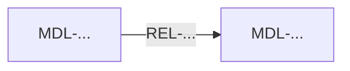

# System Model

## Artifact metadata

- Modeling ID: `MODEL-...`
- Repository/commit: `...`
- Source investigation: `...`
- Status: `DRAFT`

## Approved problem coverage

| Problem ID | Model elements | Evidence | Coverage |
|---|---|---|---|
| PS-001 | MDL-... | F-... | PARTIAL |

## Scope and limitations

## Executive model summary

## Actors and entry points

## Components and ownership

## Execution path

## State and data flow

## Transaction, concurrency, retry, and failure boundaries

## Source of truth

## Actual behavior

## Intended behavior

## Candidate invariants

## Behavior gap

## Evidence-to-model transformations

For every material transformation, state premises, evidence IDs, structured rationale, alternatives, falsification conditions, and limitations. Do not expose private chain-of-thought.

## Unknowns and conflicts

## Model consistency assessment

## Mermaid diagram

## Gate

- Status: `MODEL_INCOMPLETE`
- Next state: `SYSTEM_MODEL`
